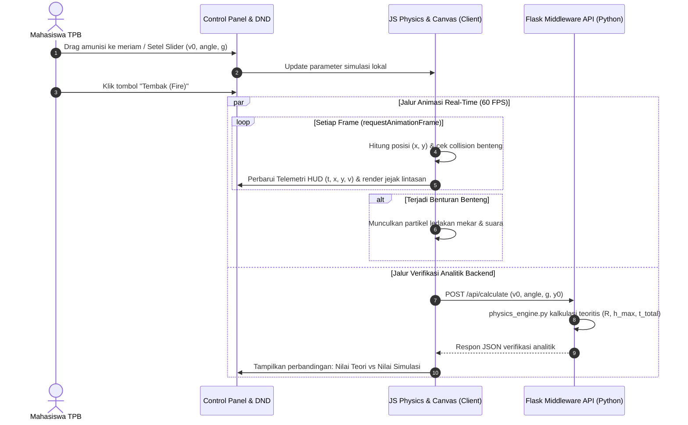

# PLAN.md — Roadmap, Status Pelaksanaan & Keputusan Arsitektur

Dokumen ini adalah dokumen pelacak progres dinamis (**paling sering diperbarui**) untuk memonitor tahap pengembangan, backlog teknis, status fitur, dan keputusan arsitektur (*Architecture Decision Records / ADR*) pada proyek **Virtual Lab Fisika TPB ITB: Simulasi Gerak Parabola & Tembakan Meriam**.

---

## 1. Status Proyek Saat Ini

* **Fase Siklus Hidup:** **Fase 0 — Inisiasi Fondasi & Arsitektur (Foundation & Blueprinting)**
* **Target Milestone Berikutnya:** **MVP Release (Alpha v0.1.0)** — Simulasi meriam interaktif dengan canvas 2D, lintasan parabola, efek ledakan benteng sasaran, kontrol slider, dan integrasi backend Flask.
* **Ringkasan Kemajuan:**
  * Fondasi dokumentasi industri (`AGENTS.md`, `CONTRIBUTING.md`, `PLAN.md`, `README.md`) telah diselesaikan secara komprehensif.
  * Struktur pohon direktori proyek dan template file kerangka kerja telah dibuat.
  * Spesifikasi visual grafis telah diselaraskan dengan referensi tugas TPB ITB (meriam beroda kayu, bukit hijau, benteng teal, lintasan putus-putus, efek kepulan asap & ledakan).

### Checklist Status Fondasi vs Implementasi:
- [x] Perancangan arsitektur sistem hybrid (Canvas 2D client-side + Flask middleware)
- [x] Penyusunan 4 berkas dokumentasi standar industri
- [x] Pembentukan struktur direktori modular dan file template kosongan
- [ ] Implementasi backend Flask server & WSGI entrypoint (`api/index.py`, `src/app.py`)
- [ ] Implementasi service kalkulasi analitik fisika Python (`src/services/physics_engine.py`)
- [ ] Implementasi route REST API (`/api/calculate`, `/api/challenge/verify`, `/api/export`)
- [ ] Implementasi modul rendering Canvas 2D (`src/static/js/canvas.js`)
- [ ] Implementasi engine fisika kinematika client-side (`src/static/js/physics.js`)
- [ ] Implementasi interaktivitas UI & HTML5 Drag and Drop amunisi (`src/static/js/controls.js`)
- [ ] Implementasi dashboard telemetri real-time (`src/static/js/telemetry.js`)
- [ ] Desain CSS tematik responsif & tata letak lab TPB (`src/static/css/*`)
- [ ] Integrasi pengujian otomatis `pytest` dan validasi toleransi fisika

---

## 2. Fitur yang Sudah Selesai (Completed Features)

| ID Fitur | Modul / Berkas | Status | Detail Teknis & Ringkasan Implementasi |
| :--- | :--- | :--- | :--- |
| **DOC-01** | `AGENTS.md` | ✅ Selesai | Kontrak tata kelola AI, aturan ketat arsitektur, boundary stack, model data, dan panduan run. |
| **DOC-02** | `CONTRIBUTING.md` | ✅ Selesai | Standar workflow kontribusi, Git convention, panduan penamaan kode, instruksi setup lokal, dan troubleshooting. |
| **DOC-03** | `PLAN.md` | ✅ Selesai | Dokumen roadmap dinamis, pelacak task, ADR ringkas, backlog fitur, dan arsitektur alur data. |
| **DOC-04** | `README.md` | ✅ Selesai | Dokumen publikasi utama, value proposition, diagram sistem, quick start, dan tautan referensi. |
| **ARCH-01**| Direktori & Template | ✅ Selesai | Seluruh pohon folder modular (`api/`, `src/`, `templates/`, `tests/`) dan kerangka file kosong telah diinisialisasi. |

---

## 3. Roadmap & Prioritas Pengembangan

### 🔴 Prioritas Tinggi (Keamanan, Stabilitas, Fondasi Inti)
Target: Menyelesaikan fungsionalitas inti virtual lab agar dapat disimulasikan secara visual dan matematis.
- [ ] **CORE-01:** Implementasikan `src/services/physics_engine.py` untuk menghitung lintasan analitik $x(t)$, $y(t)$, waktu terbang $t_{\text{total}}$, $h_{\max}$, jangkauan $R$, dan evaluasi hit benteng.
- [ ] **CORE-02:** Implementasikan endpoint Flask di `src/routes/api_routes.py` (`/api/health`, `/api/calculate`, `/api/challenge/verify`).
- [ ] **CORE-03:** Konfigurasikan `src/app.py` dan `api/index.py` agar Flask siap dijalankan lokal maupun via Vercel Serverless Function (`vercel.json`).
- [ ] **CORE-04:** Bangun engine Canvas di `src/static/js/canvas.js` yang menggambar:
  - Latar langit berawan dan perbukitan hijau bertingkat sesuai screenshot.
  - Meriam klasik dengan roda kayu melingkar dan laras meriam silindris dengan poros rotasi sudut.
  - Benteng teal di sisi kanan dengan puncak menara dan batu bata tekstural.
  - Lintasan parabola putus-putus (*dashed line*) yang merekam koordinat historis peluru.
- [ ] **CORE-05:** Bangun engine fisika klien di `src/static/js/physics.js` dengan loop `requestAnimationFrame` untuk menggerakkan proyektil secara mulus pada 60 FPS.
- [ ] **CORE-06:** Implementasikan deteksi tumbukan (*collision detection*) AABB & lingkaran antara bola meriam dengan benteng dan permukaan tanah.

### 🟡 Prioritas Sedang (Fitur Bisnis & Fungsionalitas Interaktif)
Target: Memenuhi rubrik penilaian TPB ITB (HTML5 Drag & Drop, CSS Kreatif, Kompleksitas JS).
- [ ] **FEAT-01:** Implementasikan fitur **HTML5 Drag and Drop API** di `src/static/js/controls.js`:
  - Rak amunisi (*Armory Shelf*) tempat user dapat men-drag peluru bola meriam ke moncong meriam untuk *loading*.
  - Kemampuan men-drag posisi benteng target secara horizontal untuk mengubah jarak sasaran.
- [ ] **FEAT-02:** Bangun kontrol interaktif yang presisi:
  - Slider sudut elevasi ($\theta$: $0^\circ - 90^\circ$) yang secara langsung merotasi visual laras meriam di canvas.
  - Slider kecepatan awal ($v_0$: $0 - 100\text{ m/s}$).
  - Pilihan preset gravitasi ($g$): Bumi ($9.8\text{ m/s}^2$), Bulan ($1.62\text{ m/s}^2$), Mars ($3.71\text{ m/s}^2$).
  - Slider ketinggian awal meriam ($y_0$: $0 - 50\text{ m}$).
- [ ] **FEAT-03:** Animasi efek visual lanjutan:
  - Partikel kepulan asap abu-abu/putih mekar di moncong meriam sesaat setelah tombol *Fire* ditekan.
  - Partikel ledakan mekar warna kuning/oranye/merah saat proyektil menabrak benteng (sesuai visual ledakan di screenshot).
- [ ] **FEAT-04:** Dashboard telemetri real-time di `src/static/js/telemetry.js`:
  - Panel data HUD: Waktu berjalan ($t$), koordinat saat ini ($x, y$), kecepatan $(v_x, v_y, v)$, ketinggian puncak $h_{\max}$, jarak jatuh $R$.
  - Banner notifikasi hasil tembakan (*HIT: Benteng Hancur!* vs *MISS: Terlalu Dekat / Terlalu Jauh*).

### 🟢 Prioritas Rendah (Penyempurnaan & Nilai Tambah)
Target: Aspek opsional untuk kesempurnaan pengalaman pengguna.
- [ ] **ENH-01:** Mode Tantangan Bertingkat (*Challenge / Siege Level Mode*): Menampilkan target benteng acak dan meminta mahasiswa menghitung sudut/kecepatan yang tepat sebelum menembak.
- [ ] **ENH-02:** Fitur Ekspor Data Praktikum: Tombol untuk mengunduh log percobaan ke format CSV/JSON guna dimasukkan ke Laporan Praktikum TPB.
- [ ] **ENH-03:** Toggle Hambatan Udara Fluida: Opsi koefisien drag ($C_d$) untuk perbandingan gerak parabola ideal vs gerak dengan hambatan aerodinamika.
- [ ] **ENH-04:** Efek suara tembakan meriam & ledakan menggunakan Web Audio API sintetik (bebas aset eksternal).

---

## 4. Backlog Fitur (Future Feature Ideas)

| ID | Kategori | Deskripsi Ide | Dampak / Manfaat | Status |
| :--- | :--- | :--- | :--- | :--- |
| **BK-01** | Edukasi TPB | Soal Latihan & Evaluasi Mandiri Otomatis di Modal | Mahasiswa dapat mengerjakan kuis pre-lab langsung di aplikasi | Ideasi |
| **BK-02** | Visualisasi | Tampilan Vektor Kecepatan Real-time ($v_x$ dan $v_y$ Panah Berwarna) | Memperjelas dekomposisi vektor secara visual pada setiap titik lintasan | Direncanakan |
| **BK-03** | Visualisasi | Multi-Trajectory Overlay (Bandingkan 3 tembakan sekaligus) | Memudahkan analisa sudut elevasi optimum ($45^\circ$) | Direncanakan |
| **BK-04** | Aksesibilitas | Pintasan Keyboard (Space = Fire, R = Reset, Arrow Keys = Sudut) | Mempermudah kendali tanpa mouse | Ideasi |

---

## 5. Keputusan Teknis yang Diambil (Architectural Decision Records - ADR)

### ADR 001: Penggunaan Vanilla JavaScript & Canvas 2D murni (Bukan Framework/WebGL)
* **Status:** DITERIMA
* **Konteks:** Tugas TPB ITB mengharuskan pemanfaatan fitur dasar HTML5, Canvas, dan JavaScript di sisi browser secara optimal tanpa bloatware.
* **Keputusan:** Menggunakan HTML5 Canvas 2D API native dan Vanilla ES6 JavaScript tanpa mengimpor React, Vue, Three.js, atau game engine eksternal.
* **Konsekuensi Positif:** Ukuran aset web sangat ringan (< 150 KB), waktu muat instan (*near-instant page load*), 100% transparan untuk dinilai sesuai rubrik penugasan TPB ITB.
* **Konsekuensi Negatif:** Seluruh rendering geometris (meriam, roda kayu, benteng, partikel) harus digambar secara prosedural dengan Canvas context 2D primitives.

### ADR 002: Arsitektur Serverless Python Flask untuk Deployment Vercel
* **Status:** DITERIMA
* **Konteks:** Pengguna meminta Python/Flask sebagai middleware dan aplikasi akan dideploy di platform serverless Vercel.
* **Keputusan:** Memisahkan entrypoint lokal (`src/app.py`) dan entrypoint serverless Vercel (`api/index.py`), menggunakan blueprint modular, dan melarang dependensi berukuran besar.
* **Konsekuensi Positif:** Biaya hosting nol ($0), penskalaan otomatis, performa API serverless cepat tanpa konfigurasi VPS.
* **Konsekuensi Negatif:** Tidak dapat mempertahankan state persisten di memori server; semua state sesi praktikum dikelola di client-side (`localStorage`).

### ADR 003: Model Komputasi Ganda (Dual Physics Computation Engine)
* **Status:** DITERIMA
* **Konteks:** Animasi browser membutuhkan responsivitas tinggi (60 FPS) tanpa latensi jaringan, sementara penilaian tugas praktikum TPB membutuhkan validasi analitik yang ketat.
* **Keputusan:** Client-side JavaScript menghitung posisi partikel per-frame secara numerik dengan integrasi delta waktu, sementara Backend Flask menyediakan endpoint verifikasi analitik presisi tinggi (`/api/calculate`) untuk mengecek error relatif dan memvalidasi kebenaran teori.
* **Konsekuensi Positif:** Animasi bebas lag dan tetap lancar jika offline, namun tetap memiliki verifikasi matematika di server.

### ADR 004: Pemanfaatan HTML5 Drag and Drop API Asli
* **Status:** DITERIMA
* **Konteks:** Rubrik penilaian TPB secara eksplisit menyebutkan pemanfaatan fitur HTML5 seperti *drag-and-drop*.
* **Keputusan:** Menyediakan rak amunisi di panel samping dengan elemen HTML beratribut `draggable="true"`, serta drop zone interaktif di moncong meriam dan koordinat benteng.
* **Konsekuensi Positif:** Memenuhi rubrik nilai TPB secara langsung dan memberikan interaktivitas taktis yang memuaskan pengguna.

---

## 6. Masalah yang Diketahui (Known Issues) & Mitigasi

1. **Blur Resolusi Canvas pada Layar Retina / Hi-DPI:**
   * *Status:* Teridentifikasi.
   * *Mitigasi:* Mengalikan dimensi internal canvas dengan `window.devicePixelRatio` dan melakukan normalisasi scale `ctx.scale(dpr, dpr)`.
2. **Serverless Cold-Start pada Vercel Python Function:**
   * *Status:* Dikenal sebagai karakteristik serverless.
   * *Mitigasi:* Animasi dan simulasi utama berjalan penuh secara mandiri di sisi klien (browser). Panggilan API Flask bersifat asinkron (*non-blocking*), sehingga user tidak merasakan jeda animasi saat membuka lab.
3. **Penyimpangan Numerik Integrasi Euler pada Delta Time Tinggi:**
   * *Status:* Teridentifikasi.
   * *Mitigasi:* Membatasi $\Delta t$ maksimal per-frame (clamping dt $\le 0.05\text{ detik}$) atau menggunakan formula kinematika analitik langsung $y(t) = y_0 + v_{0y} t - \frac{1}{2}gt^2$ pada setiap tick animasi.

---

## 7. Catatan Arsitektur & Alur Data (Data Flow Architecture)

Alur interaksi pengguna, simulasi browser, dan middleware Flask digambarkan dalam diagram alir berikut:

---

## 8. Riwayat Perubahan Dokumen (Changelog)

| Versi | Tanggal | Kontributor | Ringkasan Perubahan |
| :--- | :--- | :--- | :--- |
| **v0.1.0** | 2026-10-06 | Senior Software Architect | Inisialisasi dokumen `PLAN.md`, penetapan status proyek Fase 0, perumusan roadmap prioritas, pencatatan ADR 001 - ADR 004, dan diagram alur data Mermaid. |
