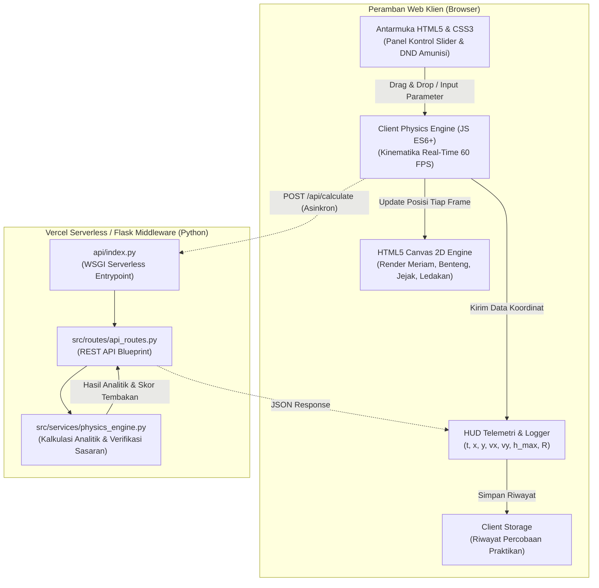

# 🎯 Virtual Lab Fisika TPB ITB — Simulasi Gerak Parabola & Tembakan Meriam

> **Media Pembelajaran Interaktif Berbasis Web untuk Pemahaman Kinematika 2D, Analisis Proyektil, dan Balistik Sasaran Benteng.**  
> *Dikembangkan khusus untuk memenuhi standar penugasan Virtual Lab TPB ITB (Fisika Dasar I) dengan teknologi Native HTML5, Canvas 2D, Drag & Drop, dan Middleware Python Flask.*

---

## 📑 Daftar Isi
- [1. Tentang Proyek](#1-tentang-proyek)
  - [Latar Belakang](#latar-belakang)
  - [Perbandingan Praktikum Konvensional vs Virtual Lab](#perbandingan-praktikum-konvensional-vs-virtual-lab)
  - [Target Persona Pengguna](#target-persona-pengguna)
- [2. Fitur Unggulan](#2-fitur-unggulan)
- [3. Tampilan Antarmuka & Referensi Visual](#3-tampilan-antarmuka--referensi-visual)
- [4. Tech Stack & Batasan Arsitektur](#4-tech-stack--batasan-arsitektur)
- [5. Diagram Arsitektur Sistem](#5-diagram-arsitektur-sistem)
- [6. Panduan Cepat (Quick Start Guide)](#6-panduan-cepat-quick-start-guide)
- [7. Struktur Direktori Proyek](#7-struktur-direktori-proyek)
- [8. Ringkasan API Endpoints](#8-ringkasan-api-endpoints)
- [9. Penilaian Rubrik TPB ITB](#9-penilaian-rubrik-tpb-itb)
- [10. Dokumentasi Terkait](#10-dokumentasi-terkait)

---

## 1. Tentang Proyek

### Latar Belakang
Praktikum Fisika Dasar (khususnya materi Kinematika Dua Dimensi / Gerak Parabola) pada Tahap Bersama (TPB) ITB memegang peranan krusial dalam membentuk intuisi fisis mahasiswa teknik dan sains. Namun, eksperimen fisik menggunakan pelontar proyektil di laboratorium seringkali terkendala oleh:
1. Variabilitas alat mekanik manual dan gesekan internal pelontar.
2. Kesulitan mengukur titik jatuh tepat ($R$) dan ketinggian puncak proyektil ($h_{\max}$) secara seketika (*real-time*).
3. Terbatasnya visualisasi vektor kecepatan dan dekomposisi gerak GLB horizontal vs GLBB vertikal.

**Virtual Lab Gerak Parabola & Tembakan Meriam** hadir sebagai solusi komputasi visual modern. Mengusung tema visual klasik meriam abad pertengahan yang menargetkan benteng (*siege cannon simulation*), media ini memungkinkan eksplorasi parameter fisik secara instan, intuitif, dan presisi tinggi di layar peramban.

### Perbandingan Praktikum Konvensional vs Virtual Lab

| Parameter Evaluasi | Praktikum Konvensional (Laboratorium Fisik) | Virtual Lab Interaktif (Aplikasi Ini) |
| :--- | :--- | :--- |
| **Akurasi Pengukuran** | Bergantung pada penggaris, stopwatch manual, dan persepsi mata (rentan human-error). | Presisi analitik hingga 4 desimal dengan integrasi numerik real-time ($60\text{ FPS}$). |
| **Eksplorasi Parameter** | Terbatas (mengubah gravitasi planet tidak mungkin dilakukan di lab fisik). | Bebas eksplorasi gravitasi Bumi ($9.8\text{ m/s}^2$), Bulan ($1.62\text{ m/s}^2$), Mars ($3.71\text{ m/s}^2$), sudut elevasi $0^\circ-90^\circ$, dan tinggi awal. |
| **Visualisasi Lintasan** | Lintasan tak terlihat; mata hanya melihat titik jatuh akhir. | Lintasan parabola tercatat utuh dalam jejak garis putus-putus (*dotted trajectory trail*). |
| **Interaktivitas & Gamifikasi** | Monoton dan kaku. | Interaktif dengan HTML5 Drag & Drop amunisi, rotasi meriam dinamis, dan tantangan menembak benteng sasaran. |
| **Efisiensi Waktu & Biaya** | Membutuhkan setup alat mekanik fisik, ruang lapang, dan resiko kerusakan alat. | Akses instan dari peramban web di mana saja tanpa instalasi perangkat lunak rumit ($0\text{ cost}$). |

### Target Persona Pengguna
* **Mahasiswa TPB ITB:** Melakukan simulasi mandiri, menguji rumus analitik gerak parabola, menyelesaikan kuis tantangan benteng, dan mengekspor data tabel praktikum.
* **Dosen & Asisten Lab (TA):** Menggunakan media simulasi untuk demonstrasi interaktif di kelas kuliah fisika dasar serta memverifikasi ketepatan pemahaman matematis mahasiswa.
* **Penilai & Reviewer:** Menguji keterpenuhan rubrik tugas TPB (HTML5 Semantic, Kreativitas CSS, Kompleksitas JavaScript, dan Arsitektur Web).

---

## 2. Fitur Unggulan

Fitur dirancang terstruktur berdasarkan peran pengguna:

| Peran Pengguna | Fitur Utama | Deskripsi Fungsionalitas |
| :--- | :--- | :--- |
| **Mahasiswa / Praktikan** | 🚀 **Simulasi Balistik Meriam 60 FPS** | Animasi pelontaran bola meriam secara real-time dengan sudut elevasi ($\theta$), kecepatan awal ($v_0$), dan tinggi awal ($y_0$) yang dapat diatur bebas. |
| | 🎯 **HTML5 Drag & Drop Amunisi** | Mengambil peluru meriam dari rak amunisi (*armory*) dan meletakkannya ke moncong meriam untuk menyiapkan tembakan, serta men-drag posisi benteng target. |
| | 📊 **Telemetri HUD Real-Time** | Menampilkan pembaruan posisi $(x, y)$, kecepatan $(v_x, v_y)$, total kecepatan $v$, ketinggian puncak $h_{\max}$, dan jarak jatuh $R$ saat peluru bergerak. |
| | 💥 **Visual Efek Ledakan & Asap** | Kepulan asap putih mekar di moncong meriam saat ditembakkan dan ledakan partikel dinamis mekar saat menghantam benteng sasaran atau tanah. |
| | 🧪 **Mode Tantangan Benteng (Siege Challenge)** | Menantang mahasiswa menghitung sudut tembakan yang tepat untuk menghancurkan benteng target pada jarak acak. |
| | 📥 **Ekspor Data Percobaan** | Mengunduh riwayat percobaan praktikum ke dalam format JSON/CSV untuk disertakan dalam Laporan Resmi Praktikum TPB. |
| **Asisten Lab / Dosen** | 🔍 **Verifikasi Teori vs Simulasi** | Endpoint Python Flask otomatis membandingkan kalkulasi analitik murni dengan hasil simulasi browser untuk menilai akurasi mahasiswa. |
| | 🌌 **Laboratorium Multi-Gravitasi** | Demonstrasi komparatif lintasan peluru di Bumi vs Bulan vs Mars untuk memperkuat konsep pengaruh percepatan gravitasi $g$. |
| **Pengembang / Reviewer** | ⚡ **Serverless Ready (Vercel)** | Arsitektur zero-cold-start burden, siap deploy ke Vercel tanpa dependensi database server yang memberatkan. |

---

## 3. Tampilan Antarmuka & Referensi Visual

Desain visual aplikasi mengacu langsung pada referensi tugas balistik TPB ITB:
* **Sisi Kiri:** Meriam klasik kuno dengan roda kayu cokelat, tumpuan logam, dan laras silindris yang dapat berotasi halus sesuai sudut tembakan.
* **Tengah:** Jalur lengkung parabola berupa garis putus-putus (*dashed line*) yang merefleksikan posisi proyektil sepanjang waktu tempuh.
* **Sisi Kanan:** Benteng batu pertahanan bertingkat (*stone castle*) berwarna teal/slate yang menjadi target tembakan.
* **Efek Spesial:** Kepulan asap di moncong meriam saat ditembakkan dan efek ledakan kuning-oranye (*burst explosion*) ketika peluru meriam berhasil menghantam puncak benteng.

---

## 4. Tech Stack & Batasan Arsitektur

### Ringkasan Tumpukan Teknologi
* **Frontend:** Semantic HTML5, Canvas 2D API, Native HTML5 Drag and Drop API, Vanilla CSS3 (Custom Properties & Glassmorphism UI), Vanilla Modern ES6+ JavaScript.
* **Backend Middleware:** Python 3.10+, Flask 3.0+, `flask-cors`.
* **Runtime & Serverless:** WSGI Serverless Function via `@vercel/python` (Vercel deployment) & Python standalone (`src/app.py` untuk dev lokal).
* **Testing:** Pytest (Unit test kalkulasi rumus kinematika analitik).

### ⚠️ Batasan Arsitektur Penting (Strict Constraints)
1. **Bebas Heavy Frontend Framework:** Tidak menggunakan React, Vue, Angular, atau jQuery agar mematuhi syarat native browser TPB ITB.
2. **Bebas 3D Engine Eksternal:** Seluruh grafis dirender secara murni menggunakan Canvas 2D API prosedural (bebas Three.js / Phaser).
3. **Stateless Serverless:** Tidak ada database SQL/NoSQL terpasang yang membebani hosting Vercel; semua log sesi praktikum dikelola di client (`localStorage`) dan divalidasi via stateless Python API.

---

## 5. Diagram Arsitektur Sistem

Hubungan antara antarmuka browser, engine komputasi client, dan middleware Python digambarkan di bawah ini:



---

## 6. Panduan Cepat (Quick Start Guide)

Jalankan proyek di mesin lokal Anda dalam 4 langkah mudah:

### 1. Kloning Repositori
```bash
git clone https://github.com/evantanuri/TugasVirtualLabPWAM.git
cd TugasVirtualLab
```

### 2. Siapkan Python Virtual Environment
```bash
python3 -m venv venv
source venv/bin/activate
pip install -r requirements.txt
```

### 3. Salin Konfigurasi Environment
```bash
cp .env.example .env
```

### 4. Jalankan Server Pengembangan
```bash
python src/app.py
```
Buka peramban favorit Anda dan kunjungi: **`http://127.0.0.1:5000`**.

### 5. Jalankan Pengujian
```bash
pytest tests/ -v
```

### 6. Deployment ke Vercel (Opsional)
Pastikan Vercel CLI sudah terpasang:
```bash
vercel --prod
```

---

## 7. Struktur Direktori Proyek

```text
TugasVirtualLab/
├── .env.example             # Contoh variabel lingkungan
├── .gitignore               # Konfigurasi pengabaian Git
├── vercel.json              # Routing serverless Vercel
├── requirements.txt         # Daftar dependensi Python
├── AGENTS.md                # Panduan perilaku AI & single source of truth
├── CONTRIBUTING.md          # Panduan alur kontribusi & standar kode
├── PLAN.md                  # Roadmap pengembangan & pelacak task
├── README.md                # Dokumentasi utama proyek
├── api/
│   └── index.py             # Entrypoint serverless Vercel
├── src/
│   ├── app.py               # Runner server lokal Flask
│   ├── config.py            # Konfigurasi aplikasi
│   ├── routes/              # Route controller (API & Views)
│   ├── services/            # Logika fisika analitik backend
│   └── static/              # Asset statis: CSS, JS Canvas, Audio
├── templates/               # Berkas template HTML5 Semantic
└── tests/                   # Berkas unit test Pytest
```

---

## 8. Ringkasan API Endpoints

Seluruh endpoint backend Python mengembalikan respon dengan format JSON seragam:

| Method | Endpoint | Deskripsi | Payload Masukan (JSON) | Contoh Respon |
| :--- | :--- | :--- | :--- | :--- |
| `GET` | `/api/health` | Pemeriksaan status server | *None* | `{"status": "healthy", "service": "virtual-lab-tpb"}` |
| `POST` | `/api/calculate` | Komputasi analitik gerak parabola murni | `{"v0": 45, "angle": 45, "y0": 0, "g": 9.81}` | `{"flight_time": 6.48, "max_height": 51.57, "range": 206.42}` |
| `POST` | `/api/challenge/verify` | Evaluasi keberhasilan tembakan ke benteng | `{"target_x": 200, "target_y": 15, "params": {...}}` | `{"is_hit": true, "distance_from_center": 0.8, "score": 98}` |
| `POST` | `/api/export` | Menghasilkan data tabel praktikum siap unduh | `{"trials": [...]}` | `{"download_url": "/tmp/...", "format": "json"}` |

---

## 9. Penilaian Rubrik TPB ITB

Proyek ini dirancang secara spesifik untuk memaksimalkan seluruh kriteria penilaian tugas:

* ✅ **Penggunaan Fitur HTML5:** Menggunakan semantic tag baku (`<canvas>`, `<header>`, `<main>`, dll.), Canvas 2D API untuk rendering 60 FPS, dan native **HTML5 Drag and Drop API** pada sistem amunisi meriam.
* ✅ **Kreativitas CSS:** Tata letak fleksibel modern (Flexbox & Grid), skema warna tematik lanskap dan benteng, efek kaca modern (*glassmorphism*) pada panel kontrol, dan tipografi yang elegan.
* ✅ **Kompleksitas JavaScript:** Engine fisika kinematika 2D modular, pemodelan dekomposisi vektor kecepatan, deteksi benturan (*collision detection*) dengan benteng, sistem partikel asap & ledakan, serta telemetri real-time.

---

## 10. Dokumentasi Terkait

Untuk pemahaman mendalam tentang arsitektur dan alur pengembangan:
* 📖 [AGENTS.md](file:///home/evan/Documents/projects/TugasVirtualLab/AGENTS.md) — Kontrak perilaku AI Coding Assistant, batasan teknologi, dan skema data.
* 🛠️ [CONTRIBUTING.md](file:///home/evan/Documents/projects/TugasVirtualLab/CONTRIBUTING.md) — Standar branching, gaya penulisan kode, alur pengujian, dan troubleshooting.
* 🗺️ [PLAN.md](file:///home/evan/Documents/projects/TugasVirtualLab/PLAN.md) — Roadmap pengerjaan, task checklist, ADR (*Architectural Decision Records*), dan status saat ini.
